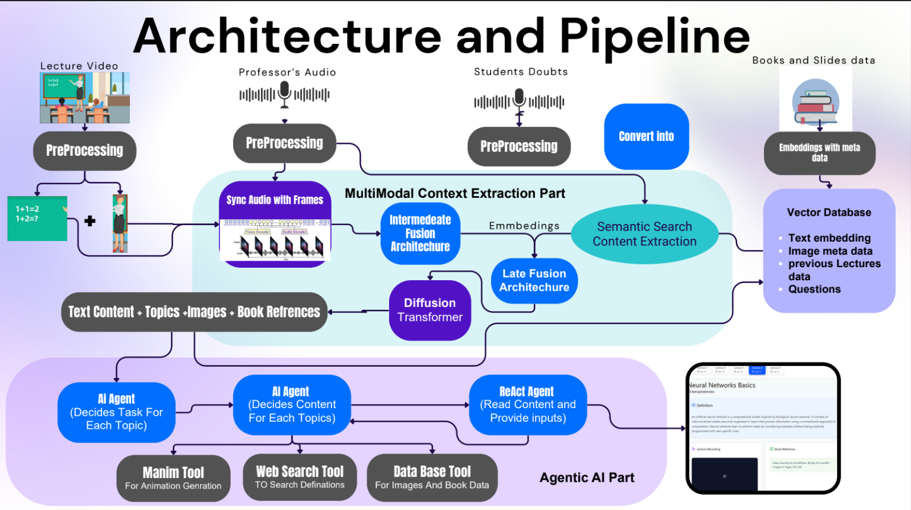

# Smart Scribes

<p align="center">
  
  
  
  
  
</p>

An AI-powered platform that enhances lectures with multimodal processing, intelligent summarization, Q&A generation, and interactive dashboards.





## 🚀 Overview

Smart Scribes transforms traditional lectures into dynamic, searchable, and interactive learning experiences by combining video, audio, and document understanding with a modern web application.

### Key Objectives

- Convert lectures into structured learning resources
- Generate intelligent summaries and study material
- Produce lecture-based Q&A automatically
- Enable multimodal search across learning content
- Improve accessibility and engagement for students

## 🎯 Features

### 📚 Lecture Summarization
Generate concise summaries, key takeaways, and structured notes from lecture content.

### ❓ Automated Q&A Generation
Create relevant questions and answers from videos, audio, and lecture documents.

### 🎥 Multimodal Understanding
Combine information from:
- Lecture videos
- Audio recordings
- PDFs and lecture slides

### 👨‍🎓 Student Dashboard
- Access lecture summaries
- Review generated questions
- Organize learning material

### 👨‍🏫 Professor Dashboard
- Upload lectures and slides
- Manage course content
- Monitor processing status

### 🗂️ Slides Management
Upload, organize, and process lecture slides with progress tracking.

### 📝 Planning Mode
Generate structured learning plans and study schedules for individual topics and lectures.

---

## 🏗️ Architecture

### Frontend
- Next.js 14
- TypeScript
- Tailwind CSS
- shadcn/ui
- Radix UI

### Backend
- Next.js API Routes
- Python Processing Pipelines

### Database & Storage
- Supabase Authentication
- Supabase Storage
- Supabase Database

### AI Pipeline
- Audio Processing
- Video Frame Extraction
- Embedding Generation
- PDF Understanding
- Multimodal Retrieval
- Summarization & Q&A Generation

---

## 📁 Folder Structure

```text
Smart-Scribes/
├── Model Training NoteBooks/
│   └── train1.ipynb
│
├── Python_Codes/
│   ├── MultiModal/
│   ├── smart_scribes_animations/
│   ├── audio_embeddings.py
│   ├── frames_embeddings.py
│   ├── pipeline.py
│   ├── pipeline_functions.py
│   └── ...
│
├── Web-Application/
│   ├── app/
│   │   ├── api/
│   │   ├── layout.tsx
│   │   └── page.tsx
│   │
│   ├── src/
│   │   ├── components/
│   │   ├── data/
│   │   ├── lib/
│   │   ├── styles/
│   │   └── types/
│   │
│   ├── package.json
│   └── next.config.js
│
├── requirements.txt
└── README.md
```

---

## 🧪 Tech Stack

### Frontend
- Next.js 14
- TypeScript
- Tailwind CSS
- shadcn/ui
- Radix UI

### Backend
- Python 3.10+
- NumPy
- Custom AI Pipelines

### Database & Infrastructure
- Supabase
- Vercel

### Development Tools
- Git
- npm
- Node.js

---

## 🛠️ Installation

### Prerequisites

- Node.js 18+
- npm / pnpm / yarn
- Python 3.10+
- Git

### Clone Repository

```bash
git clone <repository-url>
cd <repository-name>
```

### Setup Web Application

```bash
cd Web-Application

npm install

npm run dev
```

Application will be available at:

```text
http://localhost:3000
```

### Setup Python Environment

```bash
python -m venv venv
```

#### Windows

```bash
venv\Scripts\activate
```

#### Linux / macOS

```bash
source venv/bin/activate
```

Install dependencies:

```bash
pip install -r requirements.txt
```

---

## 🧰 Development

### Available Commands

#### Frontend

```bash
npm run dev
```
Start development server.

```bash
npm run build
```
Build production application.

```bash
npm run start
```
Start production server.

```bash
npm run lint
```
Run ESLint checks.

---

## 🔌 API Routes

Located inside:

```text
Web-Application/app/api
```

### Chat

```text
chat/route.ts
```

Handles chat functionality.

### Q&A Generation

```text
qna/generate/route.ts
```

Generates lecture-based questions and answers.

### Topics

```text
qna/topics/route.ts
```

Provides topic metadata.

### Uploads

```text
upload/init/route.ts
upload/route.ts
```

Handles lecture and slide uploads.

---

## 🔮 Roadmap

### Core Platform
- [ ] Improve lecture processing pipeline
- [ ] Expand multimodal understanding
- [ ] Optimize retrieval performance

### User Experience
- [ ] Enhanced student dashboard
- [ ] Advanced professor tools
- [ ] Improved upload workflow

### AI Features
- [ ] Better summarization quality
- [ ] Personalized study plans
- [ ] Context-aware Q&A generation
- [ ] Advanced semantic search

### Deployment
- [ ] Scalable cloud infrastructure
- [ ] Monitoring and analytics
- [ ] Production optimization

---

## 🤝 Contributing

1. Fork the repository

2. Create a feature branch

```bash
git checkout -b feat/your-feature
```

3. Commit changes

```bash
git commit -m "feat: add your feature"
```

4. Push branch

```bash
git push origin feat/your-feature
```

5. Open a Pull Request

### Contribution Guidelines

- Follow TypeScript best practices
- Follow Python coding standards
- Write clean and maintainable code
- Add tests where appropriate
- Keep components modular and reusable

---

<p align="center">
  <b>Building the future of intelligent learning through multimodal AI.</b>
</p>
